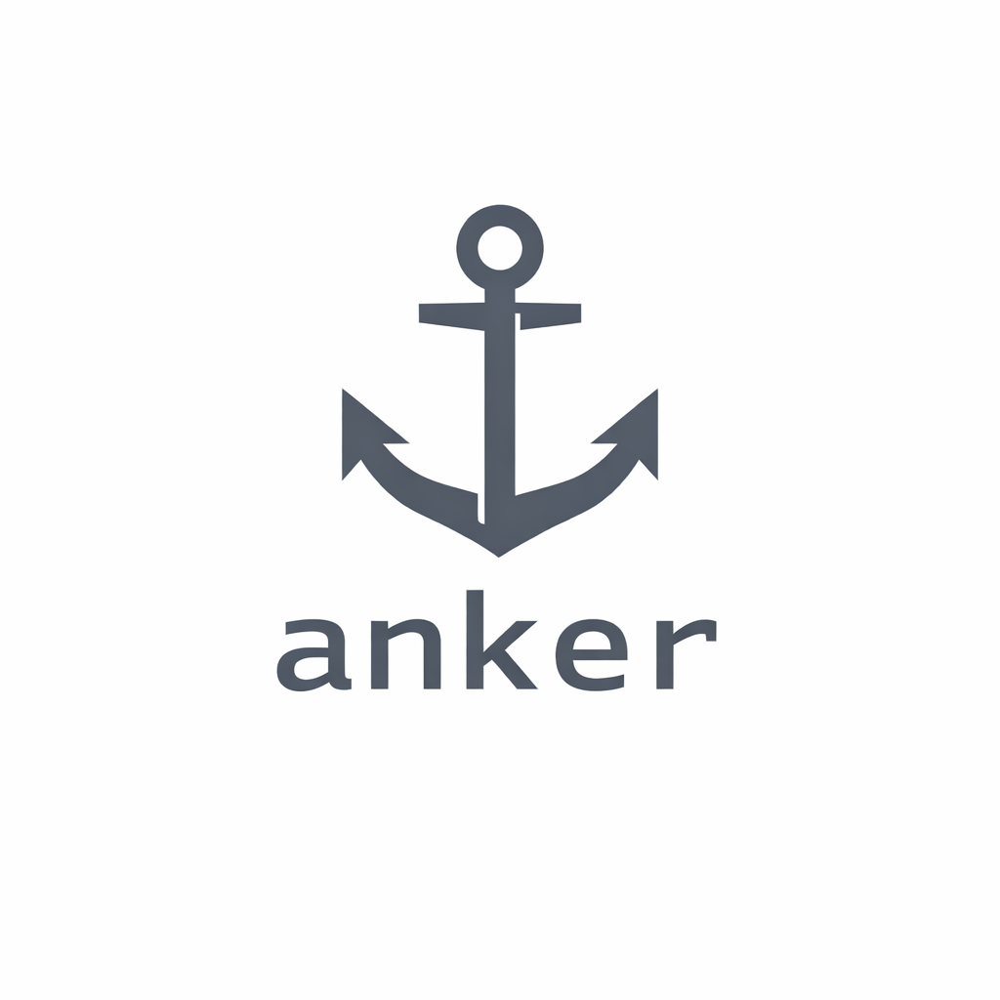

<div align="center">
  

  # ikno

  > a fixpoint for your work
</div>

**ikno** is a local CLI tool that helps you remember what you actually did — without time tracking, productivity metrics, or background agents.

**About this project:** ikno is built in collaboration with Claude AI as a demonstration of modern AI-assisted development practices. The goal is to explore how AI can accelerate software development while producing genuinely useful tools.

## Why ikno?

Work happens across multiple git repositories, scattered notes, meetings, and unplanned tasks. At the end of the day, the hard part isn't always doing the work — it's **explaining and remembering what actually happened**.

**ikno accepts the chaos.** You cannot plan everything in advance — production incidents happen, requirements change, bugs emerge. ikno helps you reconstruct your workday after the fact, without judgment or optimization.

## Philosophy

Most productivity tools focus on *measuring* time, activities, or output. They ask you to track every minute, optimize every task, and chase efficiency metrics.

**ikno takes a different approach.**

Instead of chasing classic productivity metrics, ikno embraces what we call an **#AntiProductivity mindset** — focusing on understanding *what you actually did* rather than how many minutes you logged or how much you planned/optimized.

The goal is not to make you faster, but to help you reflect on your work in a human-centric, meaningful way. ikno reconstructs your day from the sources of truth you already have (like Git), and turns your work into readable, narrative summaries.

This aligns with the belief that:
- Productivity is not about *more*.
- It's about *clarity*, *context* and *value*.

[Read more about the AntiProductivity mindset →](docs/anti-productivity.md)

### Core Principles

- **Deferred analysis** — work first, summarize later
- **Explicit over implicit** — nothing is tracked automatically
- **Local & transparent** — all data stays on your machine
- **Text-first** — human-readable storage

## Demo

<div align="center">
  
</div>

## Quick Start

### Installation

**One-line install (macOS/Linux):**
```bash
curl -sSL https://charemma.de/ikno/install.sh | sh
```

**Or download from [GitHub Releases](https://github.com/charemma/ikno/releases)**

**Or using Go:**
```bash
go install github.com/charemma/ikno@latest
```

### Basic Usage

```bash
# Add your git repositories (one-time setup)
ikno source add git ~/code/my-project
ikno source add git .

# Generate a report
ikno recap today
ikno recap thisweek
ikno recap lastmonth
```

### Example Output

```bash
ikno recap yesterday --format simple
```

```
2026-02-09 (2 activities)
  • Fix authentication bug in user service
  • Update README with installation instructions
```

### Integration with AI

**Markdown format includes full git diffs** - perfect for AI to understand actual code changes:

```bash
# Generate standup notes with code context
ikno recap yesterday --format markdown | claude -p "Create standup notes"

# Full pipeline: analyze → summarize → render
ikno recap thisweek --format markdown | claude -p "Summarize my week" | glow -p

# Code review with full diffs (markdown format includes all code changes)
ikno recap today --format markdown | claude -p "Review these changes and suggest improvements"
```

See [Usage Guide](docs/usage-guide.md#output-formats) for more examples and format details.

## Supported Data Sources

**The quality of ikno's output depends on your data sources.** The more comprehensive your sources, the better ikno can reconstruct your workday.

**Currently supported:**
- **Git repositories** — commits from tracked repos
- **Markdown files** — notes with tag or heading filters
- **Obsidian vaults** — modified/created files by timestamp

**Planned sources:**
Calendar events, browser history, issue trackers (Jira, Linear, GitHub Issues), communication tools.

**We need your help!** If you have ideas for additional sources, please [open an issue](https://github.com/charemma/ikno/issues) or contribute via pull request.

## Documentation

- **[Usage Guide](docs/usage-guide.md)** - Complete command reference, examples, integrations
- **[Configuration](docs/configuration.md)** - Config options, environment variables
- **[Building & Testing](docs/building-and-testing.md)** - Nix flake build system, CI/CD
- **[Architecture Decisions](docs/decisions/)** - Design rationale and ADRs
- **[Roadmap](TODO.md)** - Planned features and improvements

## Privacy & Data

**ikno has no default data sources.** Every source must be explicitly added by you with `ikno source add`. ikno does not monitor your system or collect data automatically.

**Your data stays local:**
- No telemetry, no analytics, no cloud sync
- All storage in plain text files (`~/.ikno/`)
- Human-readable YAML and Markdown
- No background processes or filesystem watchers

## Contributing

We're in the early stages and welcome contributions! Whether it's:
- New data source providers
- Bug fixes and improvements
- Documentation enhancements
- Feature ideas

See our [Issue Templates](https://github.com/charemma/ikno/issues/new/choose) to get started.

## What ikno is NOT

- Not a time tracker
- Not a productivity optimizer
- Not a background daemon
- Not a cloud service
- Not a monitoring tool

## License

Apache 2.0 — see [LICENSE](LICENSE) for details.

---

**Get started now:**
```bash
curl -sSL https://charemma.de/ikno/install.sh | sh
ikno source add git .
ikno recap today
```
